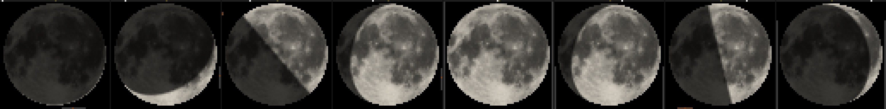
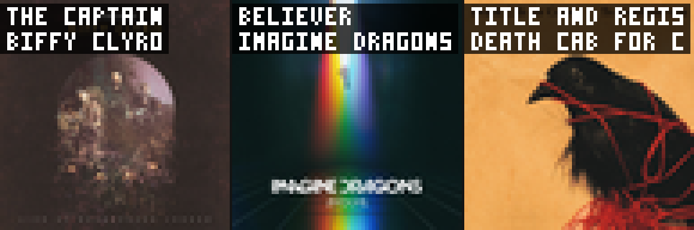

# iDotMatrix Home Assistant Integration

A focused Home Assistant integration for **iDotMatrix** pixel art displays, built around
automation-driven image display. Connects directly to your device via Bluetooth (native
adapter or ESPHome proxy) with no cloud dependencies.

---

## Features

- **Moon phase display** — renders a real-time moon phase image using your HA home location
- **Now playing** — shows album art with paged track/artist overlay from any HA media player
- **Display any image** — send a PNG, JPG, or animated GIF; automatically centre-cropped and resized to 64×64
- **Automation-friendly** — all display modes are triggered by service calls; schedule and combine them however you like
- **Temporary displays** — `display_for` reverts back to the previous default after a set number of seconds
- **Persistent default** — the last permanent display call is saved to disk and replayed on HA restart and device power-cycle
- **Light entity** — turn the screen on/off and adjust brightness; turning on replays the current default

---

## Previews

**Moon phase** — new moon through to waning crescent, rendered from London at 6× zoom. The top pixel row is a lunar cycle progress bar; the ring indicator shows the moon's current position in the sky.



**Now playing** — album art centre-cropped to 64×64 with pixel-font track and artist overlay.



---

## Installation

Copy `custom_components/idotmatrix/` into your HA `config/custom_components/` directory
and restart Home Assistant. The device will be discovered automatically via Bluetooth if
nearby, or you can add it manually via **Settings → Integrations → Add Integration → iDotMatrix**.

---

## Services

### `idotmatrix.display_moon`

Renders the current moon phase (using your HA home lat/lon/elevation) and uploads it to
the display. Becomes the new default.

```yaml
action: idotmatrix.display_moon
```

### `idotmatrix.display_now_playing`

Fetches album art from a media player entity, overlays scrolling track and artist text,
and uploads as an animated GIF. Becomes the new default. GIFs are cached on disk by
content hash — repeat plays are instant.

```yaml
action: idotmatrix.display_now_playing
data:
  entity_id: media_player.living_room_speaker
```

### `idotmatrix.display_image`

Uploads any image or animated GIF. The image is automatically centre-cropped to square
and resized to 64×64. Becomes the new default unless `display_for` is set.

```yaml
action: idotmatrix.display_image
data:
  path: /config/www/doorbell.gif
  display_for: 15   # optional — reverts to previous default after 15 seconds
```

All three services accept an optional `display_for` (seconds). When set, the call is
**temporary** — it displays for that duration then automatically reverts to whichever
display was set before. Without `display_for`, the call updates the persisted default.

### `idotmatrix.display_emoji`

Fetches a [Twemoji](https://github.com/twitter/twemoji) PNG for the given emoji, resizes
it to 64×64, and uploads it. Accepts a raw emoji character (`⚡`), a bare name (`zap`),
or a colon-wrapped name (`:zap:`).

Optional `line1` and `line2` parameters overlay up to 15 characters of pixel-font text
in the top-left corner of the display (3×5 px glyphs, 4 px advance). The text is drawn
in white over a darkened background region so it remains legible over any emoji.

```yaml
action: idotmatrix.display_emoji
data:
  emoji: zap
  display_for: 15   # optional
  line1: "NE"       # optional — max 15 chars
  line2: "12KM"     # optional — max 15 chars
```

### `idotmatrix.display_stream`

Repeatedly snapshots a camera entity and pushes frames to the display for the given
duration. Always temporary — reverts to the default display when done. Any other display
action cancels an in-progress stream. Expected frame rate is 1–3 FPS over BLE.

```yaml
action: idotmatrix.display_stream
data:
  entity_id: camera.front_door
  stream_for: 30
```

---

## Display model

The integration uses a two-layer display model:

**Default display** — the idle state of the screen. Set by any service call made
*without* `display_for` (e.g. `display_moon`, `display_now_playing`). Persisted to disk
and replayed on HA restart or device power-cycle. Think of this as "what the display
shows when nothing is happening."

**Temporary display** — any service call made *with* `display_for` or `stream_for`.
Shows for the given duration then automatically reverts to the default. Does not change
the persisted default.

The recommended pattern for event-driven displays is to drive them entirely from HA
automations using a priority sensor, leaving the integration to handle revert-to-default
automatically:

```yaml
# 1. Set your idle display (do this once, e.g. on startup)
action: idotmatrix.display_moon

# 2. Use a priority template sensor in HA to decide what event is active
template:
  - sensor:
      name: iDotMatrix Active Display
      state: >-
        
          doorbell
        
          person
        
          none
        

# 3. One automation watches the sensor and streams the right camera
automation:
  - alias: iDotMatrix Display Priority
    trigger:
      - platform: state
        entity_id: sensor.idotmatrix_active_display
    condition:
      - condition: template
        value_template: "{{ trigger.to_state.state != 'none' }}"
    action:
      - choose:
          - conditions: "{{ trigger.to_state.state == 'doorbell' }}"
            sequence:
              - action: idotmatrix.display_stream
                data:
                  entity_id: camera.front_door
                  stream_for: 30
          - conditions: "{{ trigger.to_state.state == 'person' }}"
            sequence:
              - action: idotmatrix.display_stream
                data:
                  entity_id: camera.front_door
                  stream_for: 15
```

Higher-priority events automatically cancel lower-priority streams because each
`display_stream` call cancels any in-progress stream before starting a new one.

---

## Entities

| Entity | Type | Notes |
|---|---|---|
| `light.idotmatrix` | Light | On/off + brightness. Attributes show current display info. |
| `sensor.idotmatrix_ble_connected` | Sensor | `connected` / `disconnected` |
| `sensor.idotmatrix_last_updated` | Sensor | Timestamp of last successful upload |

Turning `light.idotmatrix` **on** calls `screenOn()` and replays the current default display.

---

## Example automations

**Moon phase — refresh every 5 minutes**
```yaml
automation:
  - alias: iDotMatrix Moon Refresh
    trigger:
      - platform: homeassistant
        event: start
      - platform: time_pattern
        minutes: "/5"
    condition:
      - condition: template
        value_template: >
          {{ state_attr('light.idotmatrix', 'display_mode') in ['moon', None] }}
    action:
      - action: idotmatrix.display_moon
```

**Now playing — show art when track changes, revert to moon when stopped**
```yaml
automation:
  - alias: iDotMatrix Now Playing
    trigger:
      - platform: state
        entity_id: media_player.living_room
        to: "playing"
      - platform: state
        entity_id: media_player.living_room
        attribute: media_title
    condition:
      - condition: state
        entity_id: media_player.living_room
        state: "playing"
    action:
      - action: idotmatrix.display_now_playing
        data:
          entity_id: media_player.living_room

  - alias: iDotMatrix Music Stopped
    trigger:
      - platform: state
        entity_id: media_player.living_room
        not_to: "playing"
    action:
      - action: idotmatrix.display_moon
```

**Doorbell — stream camera then return to whatever was showing**
```yaml
automation:
  - alias: iDotMatrix Doorbell
    trigger:
      - platform: state
        entity_id: binary_sensor.front_door_visitor
        to: "on"
    action:
      - action: idotmatrix.display_stream
        data:
          entity_id: camera.front_door
          stream_for: 30
```

**Lightning strike — show emoji with direction and distance**
```yaml
automation:
  - alias: iDotMatrix Lightning
    trigger:
      - platform: state
        entity_id: sensor.home_lightning_counter
    condition:
      - condition: template
        value_template: >
          {{ trigger.to_state.state | int(0) > trigger.from_state.state | int(0) }}
    action:
      - action: idotmatrix.display_emoji
        data:
          emoji: zap
          display_for: 15
          line1: >-
            
            
            {{ dirs[((az + 22.5) % 360 / 45) | int] }}
          line2: >-
            {{ states('sensor.home_lightning_distance') | float(0) | round(0) | int }}KM
```

**Screen on/off**
```yaml
automation:
  - alias: iDotMatrix Screen Off
    trigger:
      - platform: time
        at: "21:00:00"
    action:
      - action: light.turn_off
        target:
          entity_id: light.idotmatrix

  - alias: iDotMatrix Screen On
    trigger:
      - platform: time
        at: "07:00:00"
    action:
      - action: light.turn_on
        target:
          entity_id: light.idotmatrix
```

---

## Credits

This integration is a fork of
[tukies/iDotMatrix-HomeAssistant](https://github.com/tukies/iDotMatrix-HomeAssistant)
(GPL v3 licence). The original project provided the Bluetooth client library and initial
integration scaffolding. This fork has been substantially rewritten — the display
architecture, service API, and entity model are entirely new — but the underlying BLE
protocol work from the original authors is preserved and credited. As a derivative work
of a GPL v3 project, this fork is also distributed under GPL v3.

The moon phase renderer is based on astronomical calculations using the
[ephem](https://pypi.org/project/ephem/) library.

The pixel-font text overlay is ported from
[tomglenn/idx-ai](https://github.com/tomglenn/idx-ai) (MIT licence).
